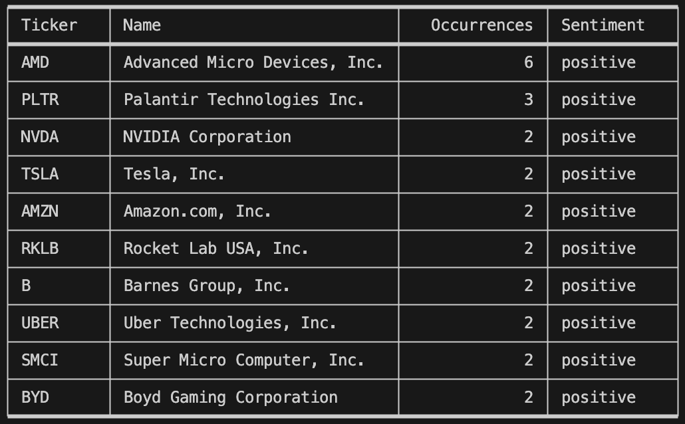

# Reddit Stock Scraper & Sentiment Analyzer

## Video Demo
🔗 [Watch on YouTube](https://youtu.be/gRL9q0WFo2A)

## Description
This script, when initiated, uses Reddit's API to search the 100 top *Hot* submissions
in a number of the most popular and active stock market-related subreddits for mentions
of stock tickers. When found, it determines the sentiment of the accompanying text.  
This data is then sorted to determine the **top ten most mentioned stocks** and their sentiment, 
which is printed in an ASCII art table.

## Example Output


## Required Third-Party Packages
This script requires that a number of third-party packages be installed in the Python
environment you are running this script in. These packages are:
`praw`, `dotenv`, `transformers`, `tabulate`, and `yfinance`.

You can find the pip installers [here.](requirements.txt)

## Details and How to Modify
There are a number of ways to customize this script to modify or fine-tune the final results. These details will be explained below in the descriptions for each function.

### main()
The main function simply calls the required functions and prints the final results in an ASCII art table using `tabulate`. No input is required, and nothing should be modified.

### scrape_reddit()
This function is called by `main()` and scans Reddit submissions for stock tickers. The function returns a list of dictionaries that contains all the discovered stock tickers, the company names, the number of occurrences in various submissions, and the comments relating to the mentioned stocks.  

This function uses the `praw` library to access Reddit's API, then uses **regular expressions** to search for possible tickers, and finally, it uses the `yfinance` library to validate the tickers and get the corresponding company names.

The pip installers can be found [here.](requirements.txt)

#### Variables to Modify

- **`search_number =`**  
  The default is **100**, meaning the `scrape_reddit()` function will search through 100 posts to look for stock tickers. This can be changed to any positive integer. Beware that as this number increases, the script requires significantly more time to run.

- **`sublist =`**  
  This variable contains the names of all the subreddits that will be searched. The default subreddits are `Stocks`, `StockMarket`, `Investing`, and `WallStreetBets`. A new subreddit can be added by using quotes and a `+` sign at the beginning (`"+NewSubredditHere"`).

- **`pattern =`**  
  The `scrape_reddit()` function uses **Regular Expressions** to match words between one and five characters containing only letters (A-Z).  
  If the final results contain any stock tickers that the user knows to be incorrect or wants to exclude, they may be added to the RegEx pattern list.

### get_sentiment(top_10)
This function takes the `top_10` list returned by `scrape_reddit()` and replaces the "Comments" key and corresponding values with "Sentiment" and a corresponding value of `positive` or `negative`.  
It does this by running each comment through the `analyze_sentiment()` function.  

The returned list of dictionaries contains, for each stock, its **Ticker, Company Name, Number of Occurrences, and Sentiment**.

### analyze_sentiment(text)
This function is automatically called by `get_sentiment()` and takes a string of text as input.  
It **analyzes the sentiment** of a Reddit submission (title and body) and returns a value of `positive` or `negative`.

This function implements **machine learning and natural language processing (NLP)** by using the **Hugging Face Transformers Library** to analyze inputted text.

The pip installer can be found [here.](requirements.txt)

The default model used to analyze the text is  
[**mwkby/distilbert-base-uncased-sentiment-reddit-crypto**](https://huggingface.co/mwkby/distilbert-base-uncased-sentiment-reddit-crypto#distilbert-base-uncased-sentiment-reddit-crypto).  
This model is pre-trained to determine the sentiment of Reddit comments (specifically related to cryptocurrency, but it has worked well for financial and stock sentiment.)  

Additional models can be found [here](https://huggingface.co/models?pipeline_tag=text-classification&sort=trending) and can be implemented by swapping out the code in the `sentiment_analysis` variable.

```python
sentiment_analysis = pipeline("text-classification", model="mwkby/distilbert-base-uncased-sentiment-reddit-crypto")
